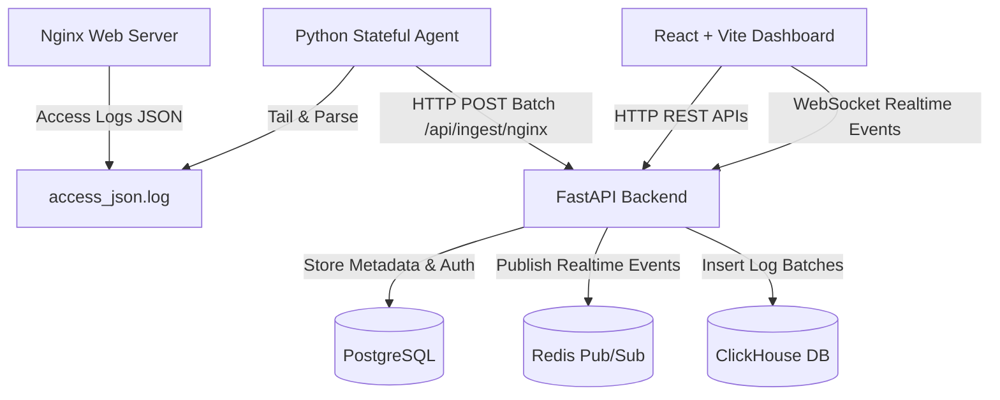

# Nginx Realtime Monitoring Ecosystem

A high-performance, real-time Nginx request monitoring and analytics ecosystem. It is divided into three key components, each designed to run independently and ready to be hosted in separate repositories.



---

## 📂 Project Structure & Repositories

This project consists of 3 major independent subsystems:

| Subsystem | Folder | Purpose | Key Technologies |
| :--- | :--- | :--- | :--- |
| **Backend** | [`/backend`](./backend) | REST APIs, WebSockets, DB management, log ingestion pipeline | FastAPI, SQLAlchemy, Alembic, PostgreSQL, ClickHouse, Redis |
| **Frontend** | [`/frontend`](./frontend) | Beautiful management console, real-time graphs, and alert center | React, Vite, Ant Design (AntD), AntD Charts, ReactFlow |
| **Agent** | [`/agent`](./agent) | Lightweight, stateful agent that tails logs and ships them | Python, Stateful Tailing (Offsets), PyYAML, Requests |

---

## ⚡ Infrastructure & Application Setup (Docker Compose)

The Docker Compose setup handles ClickHouse, Redis, Backend, and Frontend. PostgreSQL runs on an external server and is configured via environment variables.

### 1. Configure Environment Variables
Copy `.env.example` to `.env` in the root directory, and configure `POSTGRES_SERVER`, `POSTGRES_PORT`, and credentials:
```bash
cp .env.example .env
```

### 2. Build and Launch All Services
Start ClickHouse, Redis, Backend, and Frontend in detached mode:
```bash
docker compose up -d --build
```
This spins up:
* **ClickHouse** (`localhost:8123` HTTP / `9000` Native): Stores massive volumes of structured Nginx access logs for sub-millisecond analytics.
* **Redis** (`localhost:6379`): Serves as a Pub/Sub message broker for pushing real-time log lines to connected frontend clients.
* **Backend** (`localhost:8000`): FastAPI server handling REST APIs, WebSockets, DB migrations & log ingestion. Connects to external PostgreSQL (`POSTGRES_SERVER`).
* **Frontend** (`localhost:3000`): React + Vite Dashboard management console.


If you ever need to reset databases and start fresh:
```bash
docker compose down -v
```

---

## 📝 Nginx Log Configuration

To use the system in production, configure Nginx to format access logs as structured JSON. Add the following to your Nginx configuration (usually in `/etc/nginx/nginx.conf`):

```nginx
log_format json_monitor escape=json
'{'
  '"time":"$time_iso8601",'
  '"real_ip":"$realip_remote_addr",'
  '"remote":"$remote_addr",'
  '"cf_ip":"$http_cf_connecting_ip",'
  '"xff":"$http_x_forwarded_for",'
  '"user":"$remote_user",'
  '"scheme":"$scheme",'
  '"host":"$host",'
  '"method":"$request_method",'
  '"uri":"$uri",'
  '"args":"$args",'
  '"request":"$request",'
  '"status":$status,'
  '"body_bytes":$body_bytes_sent,'
  '"http_ref":"$http_referer",'
  '"agent":"$http_user_agent",'
  '"request_time":$request_time,'
  '"upstream_response_time":"$upstream_response_time",'
  '"upstream_addr":"$upstream_addr"'
'}';

access_log /var/log/nginx/access_json.log json_monitor;
```

---

## 🚀 How to Run Each Component

Please refer to the detailed guides inside each component's directory:
* **Backend Guide**: [`/backend/README.md`](./backend/README.md)
* **Frontend Guide**: [`/frontend/README.md`](./frontend/README.md)
* **Agent Guide**: [`/agent/README.md`](./agent/README.md)
