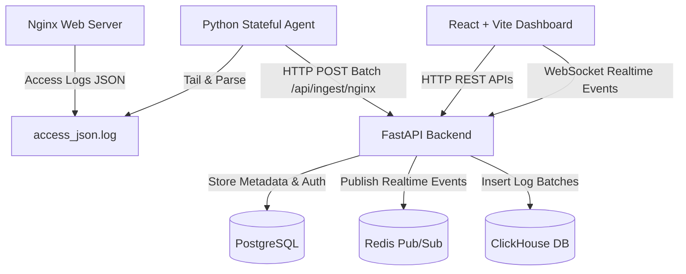

# Hệ Sinh Thái Giám Sát Nginx Thời Gian Thực (Nginx Realtime Monitor)

Hệ thống phân tích và giám sát log truy cập Nginx thời gian thực, hiệu năng cao. Dự án được chia làm 3 thành phần chính hoạt động độc lập, sẵn sàng để đưa lên các repository Git riêng biệt.



---

## 📂 Cấu Trúc Dự Án & Các Repository

Dự án này gồm 3 phân hệ hoàn toàn độc lập:

| Phân hệ | Thư mục | Mục đích | Công nghệ chính |
| :--- | :--- | :--- | :--- |
| **Backend** | [`/backend`](./backend/README_VI.md) | Các REST API, kết nối WebSocket, quản lý DB và tiếp nhận dòng log | FastAPI, SQLAlchemy, Alembic, PostgreSQL, ClickHouse, Redis |
| **Frontend** | [`/frontend`](./frontend/README_VI.md) | Giao diện điều khiển đẹp mắt, biểu đồ trực quan thời gian thực, cảnh báo | React, Vite, Ant Design (AntD), AntD Charts, ReactFlow |
| **Agent** | [`/agent`](./agent/README_VI.md) | Agent Python siêu nhẹ để tail log và đẩy dữ liệu liên tục về backend | Python, Stateful Tailing (Offsets), PyYAML, Requests |

---

## ⚡ Cài Đặt Hạ Tầng & Ứng Dụng (Docker Compose)

Docker Compose quản lý các dịch vụ ClickHouse, Redis, Backend và Frontend. Cơ sở dữ liệu PostgreSQL chạy trên máy chủ khác (bên ngoài) và được cấu hình thông qua biến môi trường.

### 1. Cấu hình biến môi trường
Sao chép file `.env.example` thành `.env` duy nhất ở thư mục gốc, sau đó tùy chỉnh địa chỉ IP/host của PostgreSQL (`POSTGRES_SERVER`), `POSTGRES_PORT` và thông tin đăng nhập:
```bash
cp .env.example .env
```

### 2. Khởi động Toàn bộ Ứng Dụng
Build và chạy tất cả các dịch vụ ở chế độ nền (detached):
```bash
docker compose up -d --build
```
Lệnh này sẽ khởi động:
* **ClickHouse** (`localhost:8123` HTTP / `9000` Native): Lưu trữ lượng lớn dữ liệu log truy cập Nginx phục vụ truy vấn phân tích tốc độ mili-giây.
* **Redis** (`localhost:6379`): Đóng vai trò là Pub/Sub broker để đẩy các sự kiện log thời gian thực lên giao diện Frontend.
* **Backend** (`localhost:8000`): FastAPI server xử lý REST API, WebSocket và ingest log. Kết nối đến PostgreSQL ngoài (`POSTGRES_SERVER`).
* **Frontend** (`localhost:3000`): Giao diện React + Vite Dashboard.


Nếu anh muốn xóa sạch dữ liệu và khởi động lại từ đầu:
```bash
docker compose down -v
```

---

## 📝 Cấu Hình Định Dạng Log Nginx

Để hệ thống hoạt động chính xác trong môi trường production, hãy cấu hình Nginx để xuất log truy cập dưới dạng chuỗi JSON có cấu trúc. Thêm đoạn cấu hình sau vào file cấu hình Nginx của anh (thường ở `/etc/nginx/nginx.conf`):

```nginx
log_format json_monitor escape=json
'{'
  '"time":"$time_iso8601",'
  '"real_ip":"$realip_remote_addr",'
  '"remote":"$remote_addr",'
  '"cf_ip":"$http_cf_connecting_ip",'
  '"xff":"$http_x_forwarded_for",'
  '"user":"$remote_user",'
  '"scheme":"$scheme",'
  '"host":"$host",'
  '"method":"$request_method",'
  '"uri":"$uri",'
  '"args":"$args",'
  '"request":"$request",'
  '"status":$status,'
  '"body_bytes":$body_bytes_sent,'
  '"http_ref":"$http_referer",'
  '"agent":"$http_user_agent",'
  '"request_time":$request_time,'
  '"upstream_response_time":"$upstream_response_time",'
  '"upstream_addr":"$upstream_addr"'
'}';

access_log /var/log/nginx/access_json.log json_monitor;
```

---

## 🚀 Hướng Dẫn Vận Hành Từng Thành Phần

Vui lòng tham khảo các hướng dẫn chi tiết bằng tiếng Việt trong từng thư mục thành phần:
* **Hướng dẫn Backend**: [`/backend/README_VI.md`](./backend/README_VI.md)
* **Hướng dẫn Frontend**: [`/frontend/README_VI.md`](./frontend/README_VI.md)
* **Hướng dẫn Agent**: [`/agent/README_VI.md`](./agent/README_VI.md)
